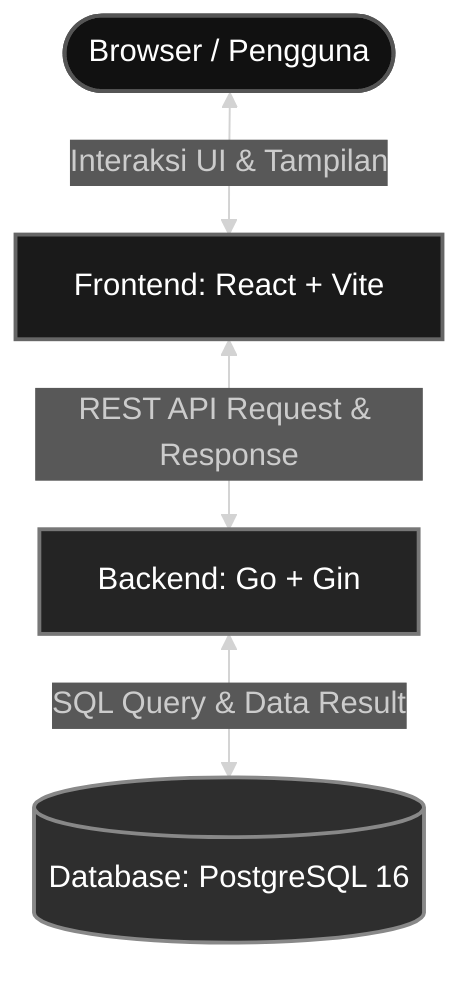

# MiniShop — Product Catalog & Cart

Aplikasi katalog produk + keranjang belanja sederhana (test case Fullstack Engineer Roketin). Client bisa melihat katalog, mencari & memfilter produk, menambah ke keranjang, dan checkout. Admin bisa mengelola produk (CRUD) dan melihat daftar order.

## Arsitektur Sistem


## Tech Stack & Alasan

| Layer | Teknologi | Alasan |
|---|---|---|
| Backend | Go + Gin + GORM | REST API ringkas, ekosistem matang; GORM menyediakan migration & transaction API yang rapi |
| Database | PostgreSQL 16 (Docker) | Mendukung `pg_trgm` untuk mempercepat search substring; transaksi & row-locking solid untuk checkout |
| Frontend | React + Vite | Setup cepat, Hot Module Replacement, ekosistem luas |

### Catatan Desain selama Develop

- **Uang sebagai `int64` rupiah utuh** — harga/subtotal/total disimpan dan dihitung sebagai integer (`BIGINT`), menghindari kemungkinan drift presisi floating point, ini sangat kritikal jika tidak diperhatikan karena akan membuat kesalahan kalkulasi.
- **Validasi Stock** — Validasi sudah diterapkan pada code aplikasi Frontend maupun Backend, dan juga diterapkan pada Database dengan menambahkan `CHECK (stock >= 0)` dan `CHECK (price >= 0)` sebagai defense-in-depth; stok negatif ditolak database sendiri, tidak hanya oleh validasi aplikasi.
- **Stok opsional pada PUT produk** — bila field `stock` tidak dikirim, stok tidak disentuh. Sebelumnya AI Tools yang saya gunakan (Claude) membuat logika PUT produk dengan mengharuskan menambahkan stock sebagai parameter, namun secara logika saya pribadi jika perubahan produk dilakukan mengharuskan menambahkan stock sebagai parameter ada terdapat kemungkinan stock yang dimasukkan sudah berubah, sehingga Ini mencegah lost update: form edit yang menyimpan stok basi tidak menimpa hasil pengurangan stok dari checkout yang terjadi di sela-selanya. Update juga berjalan dalam transaction dengan row lock.
- **Search & indexing** — saya meminta AI untuk menggunakan fitur trigram pada Postgres untuk fitur pencarian pada aplikasi, Sepengetahuan saya trigram ini dapat mengoptimalkan speed query database karena melakukan indexing pada kolom tabel (walaupun untuk saat ini mungkin speed tidak akan terlihat signifikan karena jumlah data yang sedikit, pada kasus yang saya temukan speed terasa signifikan di 50ribu data), misal nama produk akan diindexing dengna cara dipecah menjadi 3 huruf, sehingga database tidak perlu melakukan full sequential read, search nama memakai `ILIKE '%keyword%'` (leading wildcard) yang menggunakan (`pg_trgm`). Filter kategori memakai B-tree biasa; saat keduanya dipakai bersamaan planner menggabungkan lewat BitmapAnd. Dengan 50 produk seed planner tetap memilih seq scan (lebih murah di tabel sekecil ini) — index ini keputusan desain untuk skala data nyata, terverifikasi terpakai via `EXPLAIN` dengan `enable_seqscan=off`.
- **Optimasi Trigram** — Saya juga sudah menambahkan penyesuaian trigram ini pada frontend dan backend, dimana jika ingin melakukan search produk minimal input adalah 3 huruf, sehingga request ke backend dan query database akan berkurang.
- **Checkout transaksional** — satu transaction dengan `SELECT ... FOR UPDATE` per produk (diurutkan by id untuk mencegah deadlock), validasi stok ulang di server, stok dikurangi atomik, total dihitung dari harga database (bukan kiriman client). Tercakup integration test, termasuk kasus dua checkout konkuren memperebutkan stok yang sama: satu 201, satu 422, stok berakhir 0 tanpa oversell.
- **Snapshot harga** — `order_items` menyimpan nama & harga produk saat checkout sehingga riwayat order tidak berubah saat produk diedit/dihapus.
- **Sinkronisasi cart saat dibuka** — snapshot harga/stok di localStorage bisa basi (harga berubah, stok berkurang, atau produk dihapus setelah item masuk cart). Untuk memperkecil window staleness ini, halaman cart mengecek ulang tiap item ke `GET /products/:id` saat dibuka: harga yang berubah diperbarui + ditampilkan notifikasi ringkasan, item dengan stok habis atau produk yang sudah tidak ada otomatis disingkirkan dari cart. Ini murni perbaikan UX, bukan perubahan jaminan korektnya — backend tetap satu-satunya sumber kebenaran final pada proses checkout, karena request hanya mengirim `product_id` + `qty`; harga & validasi stok selalu dihitung ulang dari database saat itu juga.
- **Penanganan race condition** — dua skenario konkret ditangani secara eksplisit, bukan cuma diasumsikan aman: (1) *dua checkout konkuren memperebutkan stok yang sama* — tanpa penguncian, keduanya bisa membaca stok "masih cukup" sebelum salah satu sempat menguranginya, berisiko oversell; diatasi dengan `SELECT ... FOR UPDATE` per produk di dalam transaction (`checkout.go`), qty untuk `product_id` sama digabung dulu, dan produk diproses **terurut berdasarkan id** untuk mencegah deadlock antar dua transaksi yang mengunci produk yang sama dalam urutan berbeda — diverifikasi lewat `TestCheckoutConcurrentNoOversell` (satu 201, satu 422, stok berakhir tepat 0). (2) *Lost update saat admin edit produk bersamaan checkout berlangsung* — kalau form edit mengharuskan `stock` selalu dikirim ulang, nilai basi bisa menimpa balik hasil pengurangan checkout yang terjadi di sela-selanya; diatasi dengan membuat field `stock` opsional di `PUT /products/:id` (tidak dikirim = tidak diubah) dan update juga berjalan dalam transaction dengan row lock yang sama polanya seperti checkout.

## Menjalankan Lokal

Prasyarat: Go 1.22+, Node 18+, Docker.

```bash
# 1. Database
docker compose up -d

# 2. Backend (port 8080) — migrasi + seeder otomatis saat start
cd backend   # pastikan posisi berada di main directory project
cp .env.example .env   # Windows (cmd): copy .env.example .env
go run ./cmd/server

# 3. Frontend (port 5173)
cd frontend   # pastikan posisi berada di main directory project
npm install
npm run dev
```

Konfigurasi backend **wajib** via env — tidak ada nilai default di kode: copy `backend/.env.example` ke `backend/.env` sebelum menjalankan server (nilai contohnya sudah cocok dengan docker-compose). Frontend opsional via `frontend/.env.example`.

Seeder otomatis mengisi **4 kategori + 50 produk dummy** saat tabel products kosong — sengaja lebih dari cukup (requirement minimal 5–10) supaya pagination (default `page_size=20`, jadi 3 halaman) langsung terlihat berfungsi tanpa perlu menambah produk manual.

Lokasi Seeder : backend\migrations\001_init.sql

### Menjalankan test

Integration test checkout butuh PostgreSQL jalan dan `TEST_DB_DSN` — dibaca dari `backend/.env` (sudah ada di `.env.example`) atau dari env shell/CI (yang menang bila keduanya diset). Tanpa `TEST_DB_DSN`, test di-skip dengan pesan jelas.

```bash
cd backend
go test ./... -v
```

Mencakup: checkout sukses (penggabungan qty duplikat, total server-side, stok berkurang), stok tidak cukup (422 + detail per item, stok utuh), produk tidak ditemukan (404), **race test** dua checkout konkuren tanpa oversell, search minimal 3 karakter, dan pagination (default, penjelajahan seluruh halaman tanpa duplikat, page_size dipangkas ke maksimum, page tidak valid jatuh ke halaman 1).

## Endpoint API

Base URL: `http://localhost:8080/api`

| Method | Path | Deskripsi |
|---|---|---|
| GET | `/products?search=&category_id=&page=&page_size=` | List produk (paginated), search nama, filter kategori |
| GET | `/products/:id` | Detail produk |
| POST | `/products` | Tambah produk |
| PUT | `/products/:id` | Edit produk (`stock` opsional — tidak dikirim = tidak diubah) |
| DELETE | `/products/:id` | Hapus produk |
| GET | `/categories` | List kategori |
| POST | `/checkout` | Buat order, kurangi stok |
| GET | `/orders?page=&page_size=` | List order (paginated) |
| GET | `/orders/:id` | Detail order |

### Pagination

`GET /products` dan `GET /orders` menerima query `page` (default 1) dan `page_size` (default 20, maksimum 100 — nilai di luar batas dipangkas, nilai tidak valid jatuh ke default). Response keduanya menyertakan objek `meta` seperti dicontohkan di bawah.

### Detail Request/Response per Endpoint

Semua contoh di bawah adalah hasil request sungguhan ke server lokal (bukan data karangan), disingkat seperlunya agar tetap ringkas.

---

**`GET /products?search=&category_id=&page=&page_size=`** — list produk, paginated, search nama (min. 3 karakter, di bawah itu diabaikan), filter kategori.

Contoh: `GET /products?search=mouse`

```json
{
  "data": [
    { "id": 1, "name": "Wireless Mouse Logitek M190", "price": 189000, "description": "Mouse nirkabel 2.4GHz, baterai tahan hingga 18 bulan.", "image_url": "https://...", "stock": 25, "category_id": 1, "category": { "id": 1, "name": "Elektronik" }, "created_at": "...", "updated_at": "..." },
    { "id": 8, "name": "Mouse Pad Gaming XL", "price": 89000, "description": "Mouse pad gaming ukuran XL, permukaan halus anti slip.", "image_url": "https://...", "stock": 45, "category_id": 1, "category": { "id": 1, "name": "Elektronik" }, "created_at": "...", "updated_at": "..." }
  ],
  "meta": { "page": 1, "page_size": 20, "total": 2, "total_pages": 1 }
}
```

→ `200` selalu (search/filter yang tidak match menghasilkan `data: []`, bukan error).

---

**`GET /products/:id`** — detail satu produk.

```json
{ "data": { "id": 1, "name": "Wireless Mouse Logitek M190", "price": 189000, "description": "Mouse nirkabel 2.4GHz, baterai tahan hingga 18 bulan.", "image_url": "https://...", "stock": 25, "category_id": 1, "category": { "id": 1, "name": "Elektronik" }, "created_at": "...", "updated_at": "..." } }
```

→ `200` jika ditemukan. → `404` jika tidak: `{ "error": "product not found" }`

---

**`POST /products`** — tambah produk.

Request:

```json
{ "name": "Produk Uji Dokumentasi", "price": 50000, "description": "Contoh untuk README", "image_url": "https://...", "stock": 10, "category_id": 1 }
```

→ `201`

```json
{ "data": { "id": 51, "name": "Produk Uji Dokumentasi", "price": 50000, "description": "Contoh untuk README", "image_url": "https://...", "stock": 10, "category_id": 1, "category": { "id": 1, "name": "Elektronik" }, "created_at": "...", "updated_at": "..." } }
```

Validasi: `name` & `category_id` wajib, `price ≥ 0`, `stock ≥ 0`, `category_id` harus merujuk kategori yang ada. Contoh gagal (harga negatif) → `400`:

```json
{ "error": "invalid input: Key: 'createProductInput.Price' Error:Field validation for 'Price' failed on the 'gte' tag" }
```

---

**`PUT /products/:id`** — edit produk. `stock` **opsional**; kalau tidak dikirim, stok tidak disentuh (lihat "Penanganan race condition" di atas).

Request (tanpa `stock`):

```json
{ "name": "Produk Uji Dokumentasi (revisi)", "price": 55000, "description": "Contoh untuk README, sudah direvisi", "image_url": "https://...", "category_id": 1 }
```

→ `200` — perhatikan `stock` tetap `10` (nilai lama), tidak berubah jadi 0/kosong:

```json
{ "data": { "id": 51, "name": "Produk Uji Dokumentasi (revisi)", "price": 55000, "description": "Contoh untuk README, sudah direvisi", "image_url": "https://...", "stock": 10, "category_id": 1, "category": { "id": 1, "name": "Elektronik" }, "created_at": "...", "updated_at": "..." } }
```

→ `404` bila id tidak ada, `400` bila payload tidak valid.

---

**`DELETE /products/:id`**

→ `200` `{ "message": "product deleted" }` → `404` bila id tidak ada.

---

**`GET /categories`** — list kategori (read-only, diisi seeder).

```json
{ "data": [ { "id": 1, "name": "Elektronik" }, { "id": 2, "name": "Fashion" }, { "id": 3, "name": "Olahraga" }, { "id": 4, "name": "Rumah Tangga" } ] }
```

---

**`POST /checkout`** — buat order, kurangi stok. Body hanya `product_id` + `qty` — harga & validasi stok selalu dihitung ulang dari server, tidak pernah dipercaya dari client.

Request:

```json
{ "items": [ { "product_id": 1, "qty": 2 }, { "product_id": 4, "qty": 1 } ] }
```

→ `201` — `total` & `subtotal` dihitung server dari harga saat ini di database:

```json
{
  "data": {
    "id": 1,
    "total": 627000,
    "items": [
      { "id": 1, "order_id": 1, "product_id": 1, "product_name": "Wireless Mouse Logitek M190", "price": 189000, "qty": 2, "subtotal": 378000 },
      { "id": 2, "order_id": 1, "product_id": 4, "product_name": "Webcam HD 1080p Autofocus", "price": 249000, "qty": 1, "subtotal": 249000 }
    ],
    "created_at": "..."
  }
}
```

→ `422` bila stok tidak cukup (detail per item, stok tidak jadi dikurangi):

```json
{ "error": "insufficient stock for some items", "stock_errors": [ { "product_id": 2, "name": "Mechanical Keyboard TKL RGB", "requested": 9999, "available": 12 } ] }
```

→ `404` bila salah satu `product_id` tidak ditemukan, `400` bila payload tidak valid (mis. `qty ≤ 0`).

---

**`GET /orders?page=&page_size=`** — list order, paginated, terurut terbaru dulu.

```json
{
  "data": [
    { "id": 1, "total": 627000, "items": [ { "id": 1, "order_id": 1, "product_id": 1, "product_name": "Wireless Mouse Logitek M190", "price": 189000, "qty": 2, "subtotal": 378000 }, { "id": 2, "order_id": 1, "product_id": 4, "product_name": "Webcam HD 1080p Autofocus", "price": 249000, "qty": 1, "subtotal": 249000 } ], "created_at": "..." }
  ],
  "meta": { "page": 1, "page_size": 20, "total": 1, "total_pages": 1 }
}
```

---

**`GET /orders/:id`** — detail satu order.

```json
{ "data": { "id": 1, "total": 627000, "items": [ { "id": 1, "order_id": 1, "product_id": 1, "product_name": "Wireless Mouse Logitek M190", "price": 189000, "qty": 2, "subtotal": 378000 }, { "id": 2, "order_id": 1, "product_id": 4, "product_name": "Webcam HD 1080p Autofocus", "price": 249000, "qty": 1, "subtotal": 249000 } ], "created_at": "..." } }
```

→ `200` jika ditemukan, `404` `{ "error": "order not found" }` jika tidak.

## Known Limitations

- Belum ada autentikasi — halaman admin (`/admin/products`, `/admin/orders`) terbuka tanpa login (di luar scope requirement).
- Kategori hanya bisa dibaca (`GET /categories`) — tidak ada CRUD kategori, seeder yang mengisi.
- Snapshot cart disinkronkan saat halaman dibuka dan saat checkout ditolak (lihat "Sinkronisasi cart saat dibuka" di atas), tapi masih ada celah kecil yang inheren: perubahan harga/stok yang terjadi tepat di antara halaman dibuka dan tombol checkout ditekan baru terlihat setelah request checkout dikirim (ditangani via 422 + auto-sync ulang, bukan silent).
- Tampilan admin (`/admin/products`, `/admin/orders`) kurang optimal di layar mobile sempit tabel tetap bisa di-scroll horizontal, tapi kolom aksi (tombol Edit/Hapus, Detail) sering terpotong di luar viewport. Katalog & cart sudah responsive penuh; ini spesifik ke tabel admin, namun secara fungsional masih diguankan secara baik.
